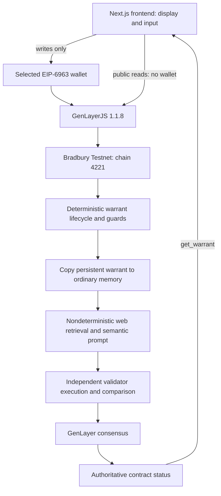

# ProofData submission architecture

Final target: **Bradbury Testnet, chain 4221**, contract `0xa73c0183e2e3605bbd5013abcb9c5683f7db1b4a`. The [proof bundle](submission-proof/README.md) identifies exact source, runner and finalized transactions.

## Product boundary

There is no application database or centralized adjudication API. Next.js server-rendered warrant and compare pages query the contract; client components construct wallet writes and track receipts. The frontend is non-authoritative. Homepage illustration is labeled; failed reads show errors rather than mock verdicts.

## Deterministic safety shell

`TreeMap[str, RelianceWarrant]` persists ID, requester, evidence reference, expected hash, purpose, risk, requirements, expiry and status. `get_warrant` exposes an address-as-string DTO.

- `create_warrant` rejects duplicate IDs and records `PENDING`.
- `retrieve_and_validate(id, current_time)` requires `PENDING` and HTTPS. It uses deterministic runtime `time.time()` for expiry; legacy caller time is ignored. Expiry or identity mismatch produces `NOT_WARRANTED`; unavailable evidence or unusable boundary output produces `INCONCLUSIVE`.
- Validator retrieval/hash agreement is compared with the stored expected hash before writing `PENDING_AI`.
- `adjudicate` requires `PENDING_AI`, takes an in-memory snapshot, runs adjudication and writes the returned status deterministically.

Expiry is checked at retrieval; the current adjudication method does not add a second expiry check. The frontend supplies declared inputs without turning them into a client-side judgment.

## Nondeterministic judgment core

Retrieval uses `gl.nondet.web.get` and hashes response bytes using `genlayer.Keccak256`. Validators independently fetch and require matching fetch status and hash. Only compact fetch/hash data crosses the equivalence boundary.

Adjudication refetches evidence, decodes text, verifies the hash of its UTF-8 encoding, builds the unchanged purpose/risk/requirements prompt and calls `gl.nondet.exec_prompt(task, response_format="json")`. The final 723-byte fixture is UTF-8 and round-trips without identity change. The demonstration concerns textual evidence, not arbitrary binary formats.

Output is `status` plus `reason`. Unknown statuses are bounded to `INCONCLUSIVE`. A hash change at adjudication also yields `INCONCLUSIVE`. The existing broad exception label remains `Fetch error: ...`; it covers operations beyond fetching. A reason string alone cannot establish the failure source.

## Storage → memory boundary

Persistent storage access is deterministic. Neither the leader closure nor validator independent execution may dereference a storage-backed warrant. The repaired source reads `storage_warrant` and calls `gl.storage.copy_to_memory(storage_warrant)` before defining nondeterministic functions. Those functions consume the copied object; afterward deterministic execution writes `storage_warrant.status`.

This minimal repair did not alter prompt wording, hashing, risk semantics, verdict schema, validator comparison, expiry hardening or runner. Historical deployment `0xb0557237CcEB48cAB5c32e4DAd5C087CB9126e0B` remains pre-fix evidence.

## Validator consensus and authoritative state

Both paths use `gl.vm.run_nondet_unsafe(leader_fn, validator_fn)`. Semantic validators execute the same path and compare **status equality**; reasons need not match. GenLayer supplies protocol voting, rotation, appeal and finalization. Contract output, consensus and execution outcome are distinct.

Outer receipt `0x1` proves submission inclusion. Tracking separately reads the GenLayer receipt. `ACCEPTED` remains provisional; completion requires `FINALIZED`, consensus `AGREE` or `MAJORITY_AGREE`, and `FINISHED_WITH_RETURN`. See [GenLayer finality](https://docs.genlayer.com/understand-genlayer-protocol/core-concepts/optimistic-democracy/finality).

The contract stores verdict status, not reason. Original reasons are preserved from consensus execution output in the proof bundle; the UI fabricates neither. Consensus on an infrastructure `INCONCLUSIVE` is not proof of LLM judgment.

## Browser integration

Configuration is centralized in `frontend/proofdata.config.json`; `config.ts` selects `testnetBradbury` and enforces the final address. The public Next.js bridge overrides stale deployment settings without accessing secret environment files.

EIP-6963 selection determines the signer even when other extensions populate `window.ethereum`. Each write verifies/switches Bradbury. A client-local EIP-1193 adapter changes only the gas field of relevant consensus submissions on chain 4221 to `max(2,000,000, ceil(SDK estimate × 1.5))`. Payload and fee fields are preserved; no dependency or global fetch patch is used.

Tracking persists public transaction IDs under a chain/contract/stage-scoped key. Reloading resumes reads, never writes. Warrant and compare pages remain accessible without a wallet.

## Demonstrated result and scope

The finalized pair used the same contract, URL, 723-byte identity, Keccak, requirements `[]` and implementation. LOW internal-note reliance returned `WARRANTED`; HIGH autonomous $250,000 treasury reliance returned `NOT_WARRANTED`. A separate real MetaMask lifecycle finalized `WARRANTED` and survived cold readback.

This establishes the submitted example, not a universal guarantee. The prototype does not enforce treasury transfers, implement revocation, prove prompt-injection immunity or establish production readiness. Broader risk taxonomies, provenance and production assurance remain future work.
